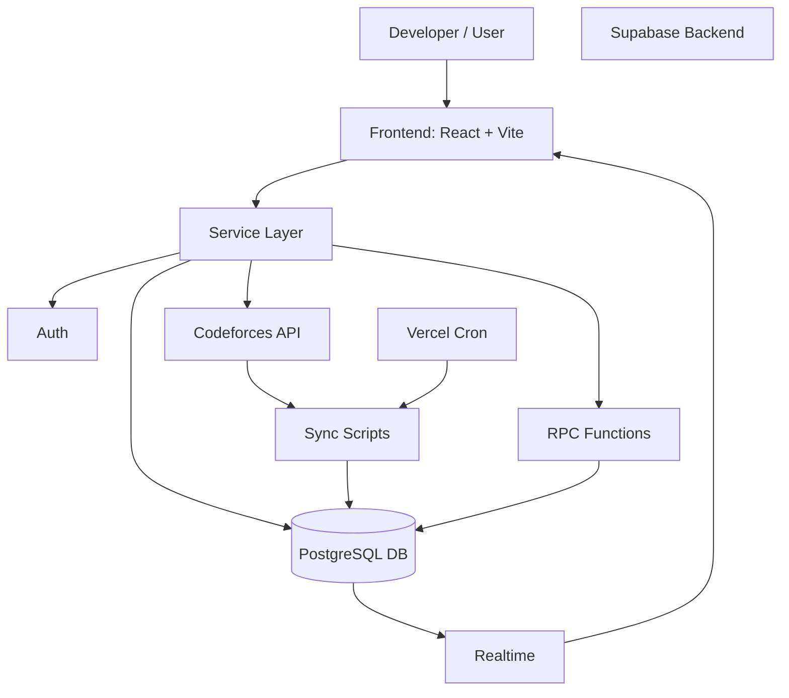
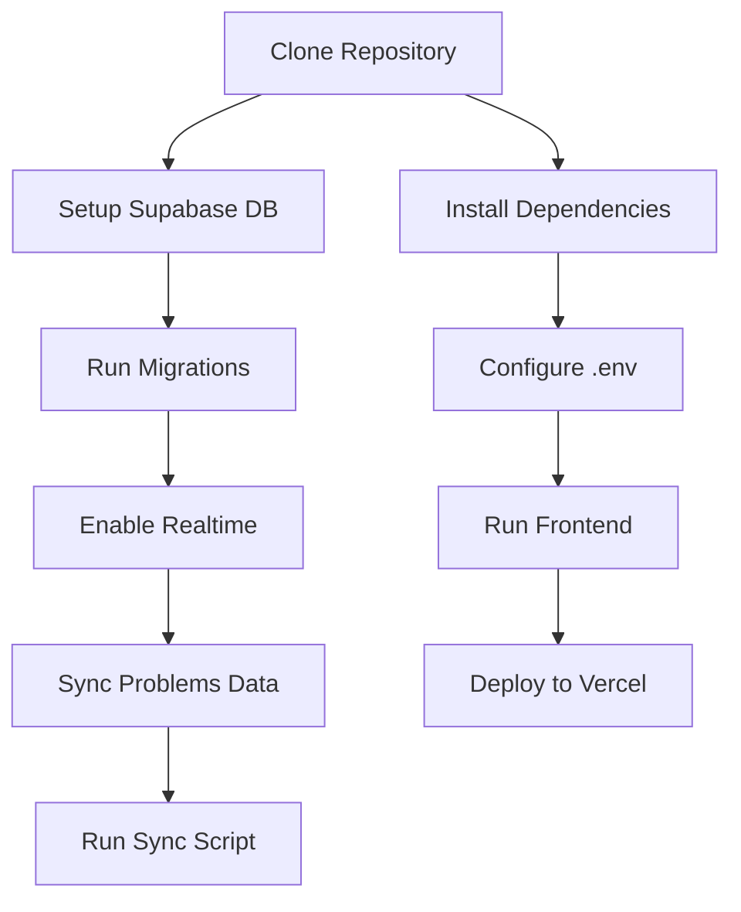

# ⚙️ CFClash —> Setup & Contributor Guide

This document helps developers:

* Set up the project locally
* Understand the system architecture
* Contribute effectively
* Debug common issues

---

# 🧭 System Overview



---

# 🔄 Setup Flow Diagram



---

# 🚀 1. Frontend Setup

## 📦 Install Dependencies

```bash id="f1"
npm install
```

## 🔐 Environment Variables

Create `.env.local`:

```env id="env1"
VITE_SUPABASE_URL=your_supabase_project_url
VITE_SUPABASE_PUBLISHABLE_KEY=your_supabase_anon_or_publishable_key
```

### Optional:

```env id="env2"
VITE_CF_API_BASE=https://codeforces.com/api
```

## ▶️ Run Development Server

```bash id="run1"
npm run dev
```

---

# 🗄️ 2. Supabase Setup

## 📌 Step 1: Apply Migrations

Run SQL files in order:

* `Supabase_schema.sql` *(reference for Supabase database table creation )*
* `supabase/migrations/20260409120000_cfclash_schema_rls_realtime.sql`
* `supabase/migrations/20260409120100_cfclash_functions.sql`

---

## 🔄 Step 2: Enable Realtime

* Ensure tables are added to Supabase Realtime publication
* Already handled via migration (`ALTER PUBLICATION`)

---

## 📊 Step 3: Sync Problems Data

```bash id="sync1"
npm run sync:problems
```

### Required env:

```env id="syncenv"
SUPABASE_URL=your_supabase_url
SUPABASE_SERVICE_ROLE_KEY=your_service_role_key
```

> ⚠️ Use service role key only in secure environments (never expose in frontend)

---

# 🌍 3. Vercel Deployment

## 🔧 Environment Variables

### Frontend:

```env id="ver1"
VITE_SUPABASE_URL
VITE_SUPABASE_PUBLISHABLE_KEY
```

### Backend:

```env id="ver2"
SUPABASE_URL
SUPABASE_SERVICE_ROLE_KEY
CRON_SECRET
```

---

## ⏱️ Cron Job Configuration

```json id="cron1"
{
  "schedule": "0 0 */2 * *"
}
```

* Runs every **2 days at 00:00 UTC**
* `*/48` is NOT valid in cron syntax

---

## 🔐 Cron Security

* Endpoint: `/api/sync-codeforces-cron`
* Requires:

```http id="auth1"
Authorization: Bearer <CRON_SECRET>
```

* Returns:

  * `503` if secret is missing
  * `401/403` if invalid token

---

## 🌐 Routing

* SPA routes handled by Vercel rewrites
* `/api/*` excluded from frontend routing

---

# 👨‍💻 4. Contributor Onboarding Guide

## 🧑‍💻 Project Structure

```
src/
 ├── pages/           # Route pages
 ├── components/      # UI components
 ├── services/        # API & business logic
 ├── hooks/           # Custom hooks
 ├── lib/             # Core utilities
 └── integrations/    # Supabase client
```

---

## 🧠 Key Concepts to Understand

* **Supabase RPC** → Handles backend logic
* **Realtime subscriptions** → Live updates in UI
* **Service layer** → Central logic for API calls
* **Codeforces sync scripts** → External data ingestion

---

## 🔄 Contribution Workflow

1. Fork repository
2. Create feature branch:

   ```bash
   git checkout -b feature/your-feature
   ```
3. Make changes
4. Run locally:

   ```bash
   npm run dev
   npm run build
   npm test
   ```
5. Commit changes
6. Push and create Pull Request

---

## 📌 Coding Guidelines

* Use TypeScript strictly
* Follow component-based architecture
* Keep logic inside `services/` instead of pages
* Avoid hardcoding API logic in UI components
* Use environment variables for secrets

---

# 🛠️ 5. Troubleshooting

## ❌ 1. Supabase Connection Error

**Error:**

```
Failed to fetch / network error
```

**Fix:**

* Check `.env.local`
* Verify `VITE_SUPABASE_URL`
* Ensure anon key is correct

---

## ❌ 2. Authentication Not Working

**Issue:**

* Login/signup fails

**Fix:**

* Check Supabase Auth settings
* Verify email confirmation is enabled/disabled properly
* Ensure redirect URLs are configured

---

## ❌ 3. No Problems Showing in Battle

**Cause:**

* `problems` table is empty

**Fix:**

```bash
npm run sync:problems
```

---

## ❌ 4. Room Creation Fails

**Possible Reasons:**

* Missing `cf_handle`
* RPC function not applied
* Database constraint failure

**Fix:**

* Complete user profile
* Ensure migrations are applied
* Check Supabase logs

---

## ❌ 5. Realtime Not Updating

**Fix:**

* Enable Realtime for tables
* Check Supabase publication settings
* Verify WebSocket connection in browser

---

## ❌ 6. Cron Job Not Running

**Check:**

* `CRON_SECRET` is set
* Authorization header is correct
* Vercel logs for execution

---

## ❌ 7. Build Errors

```bash
npm run build
```

**Fix:**

* Check TypeScript errors
* Verify missing dependencies
* Ensure environment variables exist

---

## ❌ 8. Codeforces API Issues

**Symptoms:**

* Contest list not loading

**Fix:**

* Check network tab
* Verify API base URL
* Handle rate limiting / downtime

---

# ⚠️ Important Notes

* Never expose `SUPABASE_SERVICE_ROLE_KEY` in frontend
* Always use `.env.example` for sharing config
* Keep migrations in sync with database
* Avoid modifying RPC functions without understanding dependencies

---

# ✅ Final Checklist

Before running project:

* [ ] Dependencies installed
* [ ] Environment variables configured
* [ ] Supabase migrations applied
* [ ] Realtime enabled
* [ ] Problems synced
* [ ] Cron job configured (if deployed)
* [ ] Build passes successfully

---

